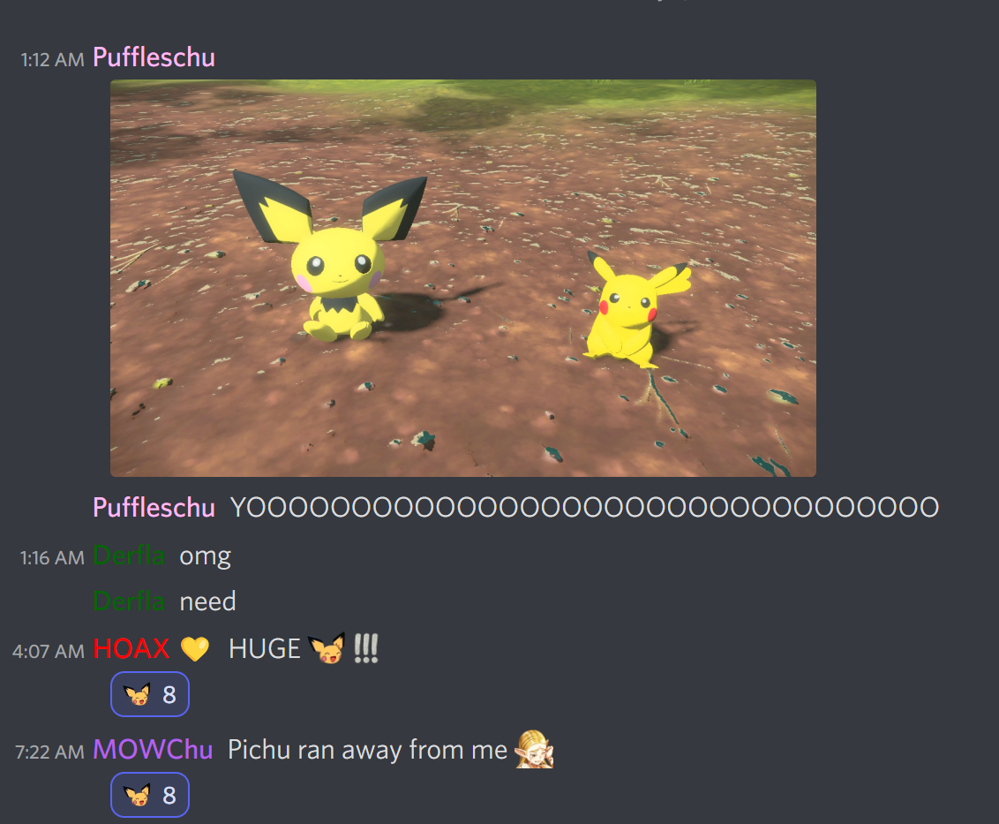

# pichu_loves_you

Minimal bot for liking content that contains pichu!

It's all in Rust.


## How to cross-compile?

```bash
cargo install cargo-zigbuild
cargo zigbuild --target x86_64-unknown-linux-musl --release
```

## How do I run this ~~dumb~~ cool and epic bot???

1. Create a discord bot here: <https://discord.com/developers/applications>
2. Bot -> Add Bot
3. Copy the token (Save this somewhere secure! You will need this!)
4. CLICK "MESSAGE CONTENT INTENT" button! You need this to read messages.
5. If you're not part of the secret pichu worship server...
    - add a pichu emoji to your server
    - add this bot to your server
    - replace ID of pichu emoji (in `main.rs`)
    - replace IDs of channels (in `pichu.toml`)
6. Run the bot:

```bash
# replace asdfadfasdf with token from step 3
DISCORD_TOKEN=<asdfadfasdf> cargo run
```


## Examples

Explicitly specified pichu appreciation channel:


All other channels:




## Reference

Serenity discord API: <https://github.com/serenity-rs/serenity>  
TOML in Rust: <https://docs.rs/toml/latest/toml/>
